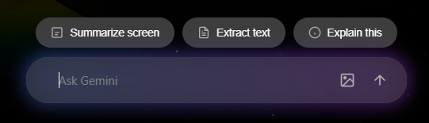
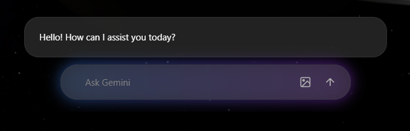

# 🌌 Gemini Copilot

A premium, glassmorphic desktop overlay for the official [Google Gemini CLI](https://github.com/google/gemini-cli). Inspired by modern spotlight-style launchers, it allows you to summon an expert multimodal agent anywhere in Windows with a single keystroke.



## ✨ Premium Features

*   **⚡ Instant Summon**: Press `Alt + Space` globally to bring up the interface.
*   **🖼️ Multimodal Vision (v0.1.5)**: Capture any screen or monitor instantly. Ask questions about your code, a design mockup, or anything visible on your display. (Significantly faster and more robust with local file ingestion bypass, headless file-flag parsing, and UTF-8 encoding support!)
*   **🛠️ Ambient Setup**: Zero manual configuration. The app automatically detects, installs, and updates Node.js and the Gemini CLI silently in the background.
*   **🔒 Secure Bridge**: Uses an isolated Python sidecar and STDIN piping to securely communicate with the Gemini CLI, bypassing common shell injection risks.
*   **🌊 Fluid Glassmorphism**: A stunning, animated UI built with native CSS backdrop filters for a transparent, high-end feel.
*   **💨 Tray-Native**: Runs quietly in the system tray. No clutter on your taskbar.

---

## 📸 Interface Preview

Compare the fluid states of the Gemini Desktop Copilot:

````carousel
### 💭 Thinking State
Instantly provides visual feedback while the multimodal agent processes your screen or prompt.

<!-- slide -->
### 💬 Final Response
Clean, readable, and beautifully formatted answers delivered directly into your workflow.

````

---

## 🚀 Getting Started

### Quick Start (Recommended)
1. Download the latest **[Setup.exe](https://github.com/MONKE2525E/gemini-copilot/releases)**.
2. Run the installer.
3. Upon first launch, the app will check your environment:
    *   **Node.js**: If missing, it will automatically trigger a secure Windows `winget` installation.
    *   **Gemini CLI**: Automatically installed/updated in the background.
    *   **Authentication**: If not logged in, a browser will open for secure Google OAuth.
4. **Press `Alt + Space`** and start querying!

### Building from Source

#### Prerequisites
*   [Rust](https://www.rust-lang.org/tools/install) (Tauri Backend)
*   [Node.js](https://nodejs.org/) (Frontend & CLI dependency)
*   [Python 3.10+](https://www.python.org/) & [PyInstaller](https://pyinstaller.org/) (Sidecar) (Only needed if not using .MSI or .EXE installer)

#### Build Pipeline
1. Clone the repository and install frontend deps:
   ```bash
   npm install
   ```
2. Compile the Python sidecar:
   ```bash
   cd python-sidecar
   python -m venv .venv
   .\.venv\Scripts\Activate.ps1
   pip install -r requirements.txt
   pyinstaller --onefile main.py
   ```
3. Build the production application:
   ```bash
   npm run tauri build
   ```

---

## 🛡️ Security & Privacy

*   **Screen Data**: Screenshots are only captured when you explicitly click the "Summarize Screen" or "Take Screenshot" buttons. Data is sent directly to Google's API.
*   **Local Keys**: This app **never** sees or stores your API keys or OAuth tokens. It leverages the official `gemini-cli` identity provider stored in `%USERPROFILE%\.gemini`.
*   **Isolated Execution**: All queries are passed to the CLI via locked STDIN pipes to prevent any form of command-line argument manipulation.

## 📄 Documentation & Architecture
For a deep dive into the 4-layer architecture of this application, or to see a historical log of bugs and their fixes, please read the **[Engineering & Incident Log](ENGINEERING_LOG.md)**. If you wish to contribute, please see our **[Contributing Guide](CONTRIBUTING.md)**.

*Note: You do **not** need Python installed to run the final `.exe` or `.msi` installers. The Python Engine is automatically compiled into a standalone executable via PyInstaller and bundled transparently into the app.*

## 📄 License
This project is licensed under the MIT License - see the [LICENSE](LICENSE) file for details.
